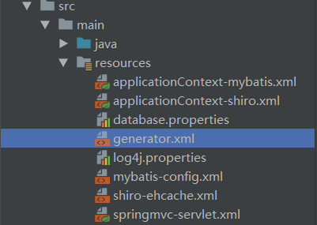
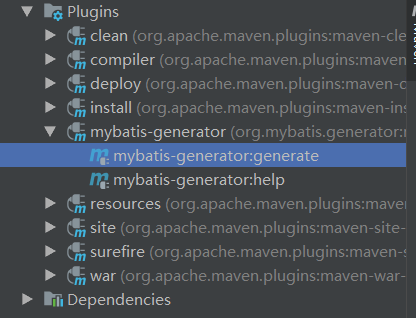

# MyBatis从手写到逆向！MyBatis Generator【MBG】的使用

## 什么是MyBatis Generator【以下简称MBG】？

MBG是一款MyBatis自动代码生成工具，可以通过配置，快速生成Entity实体类、mapper接口类和数据库xml映射文件，帮助我们从枯燥的增删改查编写中解脱出来~<br>
并且生成的每个Entity实体类下，还提供了对应的Example实例对象，别小看它，它可是十分强大的一个实例工具，之后我会详细讲解它~

## MBG配置步骤：

### 配置pom.xml

在项目的pom文件中添加插件配置

```xml
<build>
    <plugins>
        <!--代码自动生成插件-->
        <plugin>
            <groupId>org.mybatis.generator</groupId>
            <artifactId>mybatis-generator-maven-plugin</artifactId>
            <version>1.3.7</version>
            <configuration>
                <configurationFile>src/main/resources/generator.xml</configurationFile>
                <!--允许移动生成的文件-->
                <verbose>true</verbose>
                <!--允许覆盖生成的文件-->
                <overwrite>true</overwrite>
            </configuration>
            <executions>
                <execution>
                    <id>Generate MyBatis Artifacts</id>
                    <goals>
                        <goal>generate</goal>
                    </goals>
                </execution>
            </executions>
            <dependencies>
            <!--<dependency>-->
                <!--<groupId>tk.mybatis</groupId>-->
                <!--<artifactId>mapper</artifactId>-->
                <!--<version>3.5.2</version>-->
            <!--</dependency>-->
                <!--数据库驱动，必须要有，不然会报错-->
                <dependency>
                    <groupId>mysql</groupId>
                    <artifactId>mysql-connector-java</artifactId>
                    <version>5.1.29</version>
                </dependency>
            </dependencies>
        </plugin>
    </plugins>
</build>
```

### 配置generator.xml

在resource目录下创建generator.xml文件（也不一定这个名，只要和pom.xml文件下configurationFile中的名字对应上就可以了）



配置文件大致如下：

```xml

<?xml version="1.0" encoding="UTF-8"?>
<!DOCTYPE generatorConfiguration
        PUBLIC "-//mybatis.org//DTD MyBatis Generator Configuration 1.0//EN"
        "http://mybatis.org/dtd/mybatis-generator-config_1_0.dtd">

<generatorConfiguration>
    <!--数据库驱动,最好不要有中文字符,不然会找不到（如果在POM.xml里配置了驱动，这行可不写） -->
    <classPathEntry location="D:/sqljdbc4-3.0.jar" />
    
    <context id="testTables" targetRuntime="MyBatis3">
        <property name="javaFileEncoding" value="UTF-8"/>

        <commentGenerator>
            <!-- 是否去除自动生成的注释 true：是 ： false:否 -->
            <property name="suppressAllComments" value="true"/>
        </commentGenerator>

        <!--数据库连接的信息：驱动类、连接地址、用户名、密码 -->
        <jdbcConnection driverClass="com.microsoft.sqlserver.jdbc.SQLServerDriver"
                        connectionURL="jdbc:sqlserver://localhost:3306;DatabaseName=xxx"
                        userId="root"
                        password="root">
        </jdbcConnection>

        <!-- 默认false，把JDBC DECIMAL 和 NUMERIC 类型解析为 Integer，为 true时把JDBC DECIMAL 和
            NUMERIC 类型解析为java.math.BigDecimal -->
        <javaTypeResolver>
            <property name="forceBigDecimals" value="false"/>
        </javaTypeResolver>

        <!-- targetProject:生成PO类的位置 -->
        <javaModelGenerator targetPackage="cn.xxx.pojo"
                            targetProject=".\src\main\java">
            <!-- enableSubPackages:是否让schema作为包的后缀 -->
            <property name="enableSubPackages" value="false"/>
            <!-- 从数据库返回的值被清理前后的空格 -->
            <property name="trimStrings" value="true"/>
        </javaModelGenerator>

        <!-- targetProject:mapper映射文件生成的位置 -->
        <sqlMapGenerator targetPackage="cn.xxx.mapper"
                         targetProject=".\src\main\java">
            <!-- enableSubPackages:是否让schema作为包的后缀 -->
            <property name="enableSubPackages" value="false"/>
            <!-- 从数据库返回的值被清理前后的空格 -->
            <!--<property name="trimStrings" value="true" />-->
        </sqlMapGenerator>

        <!-- targetPackage：mapper接口生成的位置 -->
        <javaClientGenerator type="XMLMAPPER"
                             targetPackage="cn.xxx.mapper"
                             targetProject=".\src\main\java">
            <!-- enableSubPackages:是否让schema作为包的后缀 -->
            <property name="enableSubPackages" value="false"/>
        </javaClientGenerator>

        <!-- 指定数据库表 -->
        <table schema="" tableName="voice"/>
    </context>
</generatorConfiguration>

```

以上的配置中数据库使用的是SQL serve，如需了解更多请点击 [《MBG配置详解》](MBG配置详解.md)

### MBG启动

连接上数据库后，在Maven Projects侧找到mybatis-generator，双击



即可生成逆向代码~

## Mapper接口

生成代码后，Mapper接口里有如下方法：

> Xxx：实例对象<br>
> example：实例对象字段条件<br>
> record：实例对象数据<br>

|                                               方法                                                |                       功能                       |
|:------------------------------------------------------------------------------------------------:|:------------------------------------------------:|
|                             int countByExample(XxxExample example);                              |             按条件统计符合条件的数据条数             |
|                             int deleteByExample(XxxExample example);                             |                   按条件删除数据                   |
|                               int deleteByPrimaryKey(Integer id);                                |                   按主键删除数据                   |
|                                     int insert(Xxx record);                                      |   插入数据（实体类所有字段不得为null，否则抛出异常）    |
|                                 int insertSelective(Xxx record);                                 |         插入数据（插入实体类不为null的字段）          |
|                          List<Xxx> selectByExample(XxxExample example);                          |             按条件查询符合条件的数据列表             |
|                               Xxx selectByPrimaryKey(Integer id);                                |                   按主键查询数据                   |
|     int updateByExample(@Param("record") Xxx record, @Param("example") XxxExample example);      | 按条件更新数据（实体类所有字段不得为null，否则抛出异常） |
| int updateByExampleSelective(@Param("record") Xxx record, @Param("example") XxxExample example); |       按条件更新数据（插入实体类不为null的字段）       |
|                           int updateByPrimaryKeySelective(Xxx record);                           | 按主键更新数据（实体类所有字段不得为null，否则抛出异常） |
|                               int updateByPrimaryKey(Xxx record);                                |       按主键更新数据（插入实体类不为null的字段）       |

## example实例解析

逆向生成代码后，每个实体类都会生成一个XxxExample实例，它的作用等同于数据库语法中的*WHERE*及其后面的语法。

使用方式为：

```java
xxxExample example = new xxxExample();      //初始化一个example实例
```

|                  方法                   |                                    功能                                    |
|:--------------------------------------:|:--------------------------------------------------------------------------:|
| example.setOrderByClause(“字段名 ASC”); | 按字段名升序排列，DESC为降序（注意：字段名必须为数据表的字段名，而不是实体类的字段名） |
|      example.setDistinct(false);       |                        去除重复，true为选择不重复的记录                        |

```java
Criteria criteria = new Example().createCriteria();     //实现条件方法
```

> Xxx：字段名

|                     方法                     |            功能            |
|:-------------------------------------------:|:--------------------------:|
|           criteria.andXxxIsNull;            |         字段为null         |
|          criteria.andXxxIsNotNull;          |        字段不为null         |
|       criteria.andXxxEqualTo(value);        |        字段等于value        |
|      criteria.andXxxNotEqualTo(value);      |       字段不等于value       |
|     criteria.andXxxGreaterThan(value);      |        字段大于value        |
| criteria.andXxxGreaterThanOrEqualTo(value); |      字段大于等于value      |
|       criteria.andXxxLessThan(value);       |        字段小于value        |
|  criteria.andXxxLessThanOrEqualTo(value);   |      字段小于等于value      |
|        criteria.andXxxIn(List<？>);         |    字段值在List<？>条件中    |
|       criteria.andXxxNotIn(List<？>);       |   字段值不在List<？>条件中    |
|     criteria.andXxxLike(“%”+value+”%”);     |   字段值为value的模糊查询    |
|   criteria.andXxxNotLike(“%”+value+”%”);    |   字段值不为value的模糊查询   |
|   criteria.andXxxBetween(value1,value2);    |  字段值在value1和value2之间  |
|  criteria.andXxxNotBetween(value1,value2);  | 字段值不在value1和value2之间 |

## 方法应用举例：

```java
XxxExample xxxExample = new xxxExample();
XxxExample.setOrderByClause(“uid DESC”);
Criteria criteria = new Example().createCriteria();
criteria.andNameEqualTo('Tmiracle');
List<Xxx> list = XxxMapper.selectByExample(xxxExample);
```

**list得到的值相当于：**

```sql
SELECT * FROM Xxx 
    WHERE name = 'Tmiracle'
    ORDER BY uid DESC
```

